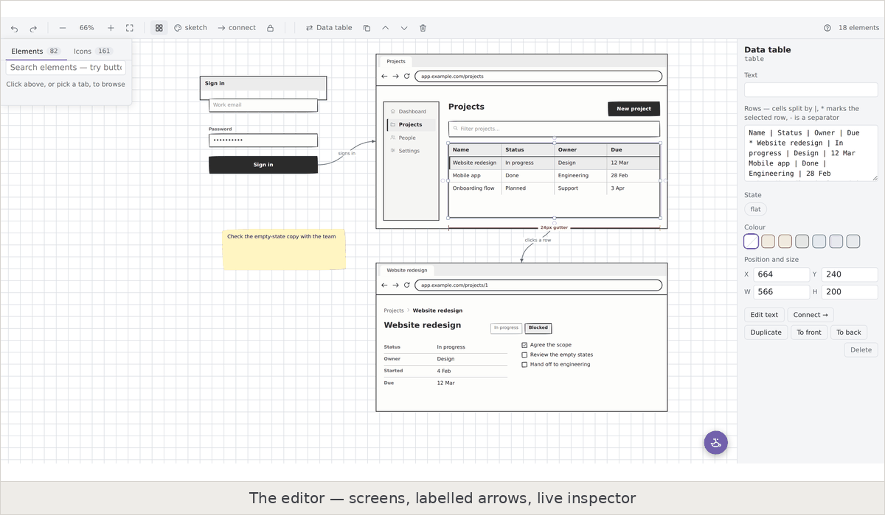
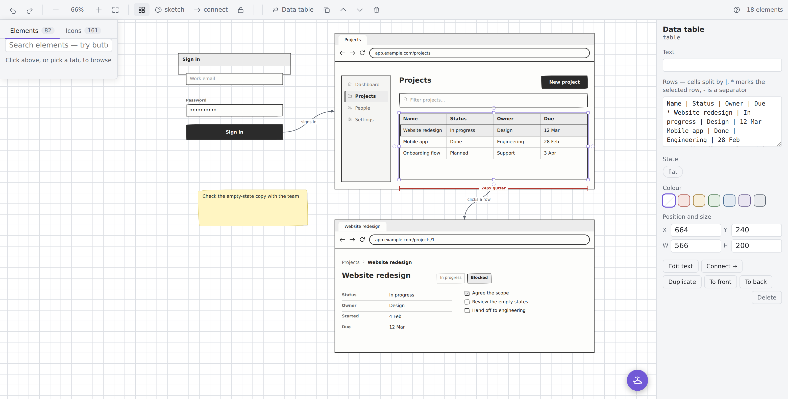
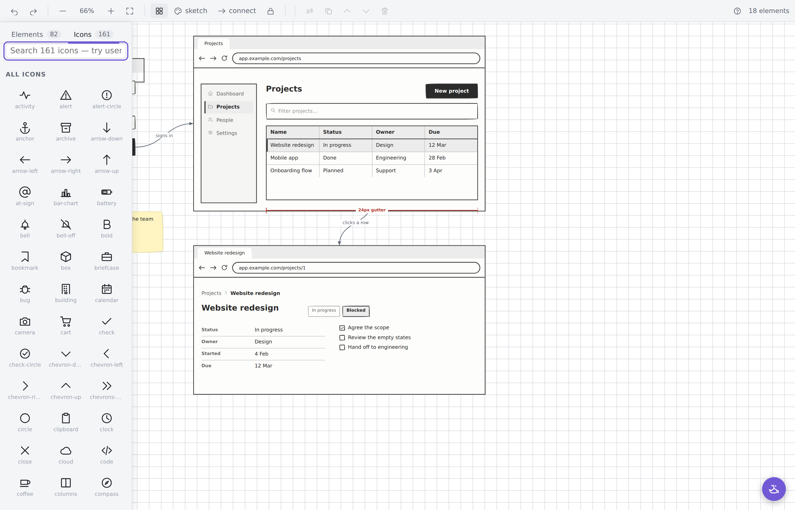
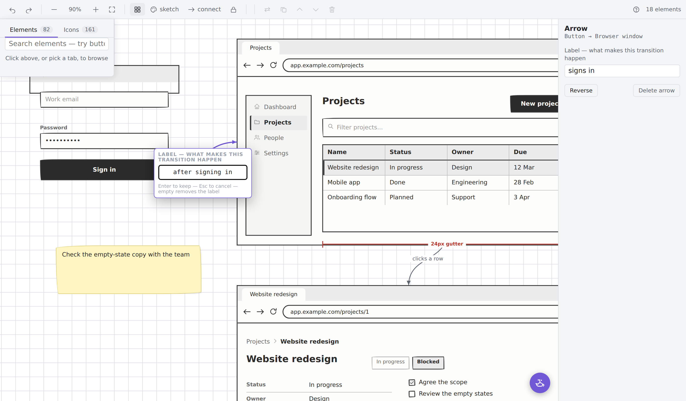
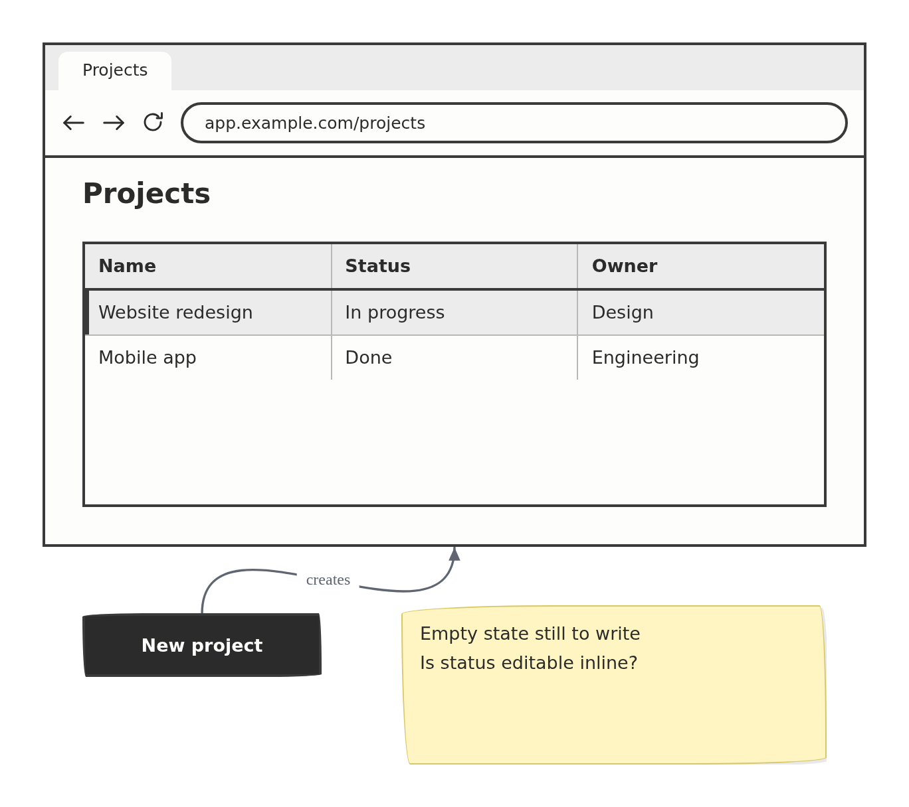

# Wireframy

Lo-fi wireframing without leaving your vault. A drag-and-drop editor with 82 UI widgets, 161 icons, shapes and text you can put anywhere, connecting arrows and three hand-drawn skins — all in a plain text file that lives next to the note it belongs to.

**82 widgets · 161 icons · transform in place · labelled arrows · a genie that reads your screenshots · presentation mode · no clickable prototyping.**



## Why

The point of a lo-fi wireframe is to look unfinished. When nothing looks final it is easier to ask "what if?", and reviewers argue about the structure instead of the font. Every polished mockup you have ever shared came back with comments about spacing.

Obsidian is already where the spec, the notes and the open questions live. Wireframy puts the drawing there too, as a `.wire` file you can diff, link to and search — not in a separate tool behind a separate login.

It draws static screens and the flow between them. It is deliberately **not** a clickable prototyper.

## Install

### From Obsidian, once it is in the directory

Settings → Community plugins → Browse → search **Wireframy** → Install → Enable.

### Manually

1. Download `main.js`, `manifest.json` and `styles.css` from the [latest release](https://github.com/Divyaraj-M/wireframy/releases/latest).
2. Put them in `<your vault>/.obsidian/plugins/wireframy/`.
3. Reload Obsidian, then enable **Wireframy** in Settings → Community plugins.

### With BRAT

Install [BRAT](https://github.com/TfTHacker/obsidian42-brat), then add `Divyaraj-M/wireframy` as a beta plugin.

## Getting started

Click the ribbon icon, or run **New wireframe** from the command palette. You get a `.wire` file with an empty browser frame in it.

- **Drag a widget** from the palette, or click one to drop it in the middle.
- **Double-click anything** to edit its text — including an arrow, to label it.
- **Drag** to move, **handles** to resize. Alignment guides appear as edges line up.
- **Hover an element's edge** and a small nub appears: click it, then click another element, to draw an arrow.
- **Nothing is nested.** Containers are boxes you place things *on top of*. That is what keeps direct manipulation simple.

## The palette

Collapsed, it is a bar of two tabs and a search box floating over the top-left of the canvas. Click it or start typing and the list opens; `Esc`, or a click back on the board, closes it. The canvas keeps its full width either way.

**Elements** opens on an **Essentials** tier — the fourteen you reach for constantly — then the full set by group.

**Icons** is all 161 as a grid, searchable by name *or* by one of 75 synonyms (`email` finds `mail`, `gear` finds `settings`), with the name under each one so you know what to type in a `wf` block. Searching Elements for something only the icons have — "camera", "printer" — offers to take you across, keeping what you typed.

## Shapes and text

`rect` (also `rectangle`, `box`) and `circle` (also `ellipse`, `oval`) are the draw-anything primitives, and **both hold text**, so a labelled box is one element rather than two stacked:

```
rect: Anything goes in here
circle: Or here
rect: Filled and dashed (fill, dashed)
triangle:
```

`text` (also `textbox`, `label`, `caption`) is free text with no box around it. `(fill)`, `(dashed)`, `(bold)`, `(muted)`, `(small)` and `(large)` change how any of them read.

## Arrows

Hover an element's edge, click the nub, then click the element you want to point at. Arrows are cubic curves that follow their elements when you move them.

**Double-click an arrow** and a box opens on the curve itself. Type what makes the transition happen — `signs in`, `clicks a row` — and `Enter` keeps it. Clearing the text removes the label.

## Changing your mind

**Transform to…** (`⌘⌥T` on macOS, `Ctrl+Alt+T` elsewhere) changes what an element **is** while keeping where it is. Text, rows and modifiers carry over wherever the new widget can hold them; the notice names anything it could not:

> Data table → Button. Text, position and size kept. Dropped: rows, bold.

Position, size and any attached arrows survive, and it is one undo step. This is the command to reach for when you realise the combo box should have been a radio group.

## Showing it to people

- **Present this board** (`⌘⇧F` / `Ctrl+Shift+F`) — chrome-free and read-only, for a meeting. `Esc` comes back.
- **Copy this board as an image** (`⌘⇧C` / `Ctrl+Shift+C`) — renders the *whole* board, not the viewport, to a PNG beside the file and onto the clipboard where the platform allows it. An element 3000px off-screen still lands in the picture.
- **Lock this board** — read-only. Panning and zooming still work; nothing can be moved. For the board you opened only to look at.

## Keeping the thinking with the drawing

- **Write board notes** creates a sibling `.md` note, linked both ways, seeded from the board: its screens, its labelled flow, and every sticky note as a `- [ ]` open question. Search, backlinks and graph view come free.
- **Create an alternate version** writes `<name> (alt).wire` beside the original, so a second take costs one keystroke and neither becomes the archived one.

## Also works inside a note, and on Canvas

The same 82 widgets render from a small indentation-based DSL in a `wf` code block, so a wireframe can sit inline in a spec:

````
```wf
window: Projects | app.example.com/projects
  row: (top)
    sidebar: Dashboard | Projects* | People
    col: (grow)
      h1: Projects
      table:
        Name | Status | Owner
        * Website redesign | In progress | Design
        Mobile app | Done | Engineering
```
````

On an Obsidian Canvas the side panel drops these blocks into nodes, groups act as screen frames and edges as flow arrows. Both modes share one renderer, so a widget can never draw two different ways.

A note containing a `wf` block, embedded as a Canvas file node, is a reusable **master**: edit it once and every instance updates.

## The widgets

**Container** — browser window, phone frame, card, screen, modal, field set, well, split panes, scroll area, row, column

**Navigation** — nav bar, tabs, vertical tabs, sidebar, open menu, menu bar, accordion, tree, breadcrumb, steps, pagination, icon toolbar, scroll bar

**Input** — text input, password, textarea, search, dropdown, checkbox, radio, toggle, slider, number stepper, date picker, calendar month, colour picker, star rating, file dropzone

**Action** — button, button group, link, icon, floating action button

**Display** — rectangle, circle / ellipse, triangle, headings, paragraph, greeked text, image, avatar, list, data table, key/value, badge, alert, progress, stat tile, bar chart, pie chart, line chart, tag cloud, sitemap, video player, map, icon row, empty state, spinner, divider, spacer

**Annotations** — sticky note, numbered callout, comment bubble, tooltip, curly braces, annotation arrow, redline measurement

Most have aliases (`button`, `dropdown`, `grid`, `kpi`…), 157 names in all. Run **Rebuild element catalog** for a note showing every one of them rendered at full width, plus the icon grid.

## Icons

The same 161 icons the palette browses are available by name anywhere a `wf` block
or a widget takes one:

```wf
icon: search
iconrow: briefcase | users | calendar | bar-chart | settings
toolbar: edit | copy | trash | more
sidebar: Dashboard:home | Projects*:folder | People:users | Settings:settings
```

`Label:icon` hangs an icon off a nav, sidebar, tab or menu item, and `*` marks the
current one. The 70 synonyms mean you rarely have to guess the canonical name —
`email` finds `mail`, `gear` finds `settings`, `tick` finds `check`, `more` finds
`more-h`. **Insert icon** in the command palette is a fuzzy search over the same
list, aliases included.

## Skins

`sketch` is hand-drawn, `clean` is flat grey, `wire` is outline-only and prints well. Switch per file from the toolbar, or globally in settings.

## Commands

Plugin-wide:

- **New wireframe** — same as the ribbon icon
- **Rebuild element catalog** — the full-width reference note
- **Open wireframe palette** — the panel for Canvas mode
- **Quick add widget** / **Insert icon** — fuzzy search, worth a hotkey
- **New screen frame** — one per device preset: Desktop, Laptop, Tablet, Mobile, Modal
- **Save selected node as master**, **Insert master**
- **Cycle skin**

Shortcuts are written macOS first: `⌘` is Command, `⌥` is Option, `⇧` is Shift.
On Windows and Linux, `⌘` is `Ctrl`. Obsidian writes the same thing as `Mod`
in Settings → Hotkeys, where you can rebind any of them.

In the editor — all scoped to an open wireframe, so their bindings stay free everywhere else:

- **Wireframe: transform to…** — `⌘⌥T` / `Ctrl+Alt+T`
- **Wireframe: present this board** — `⌘⇧F` / `Ctrl+Shift+F`
- **Wireframe: copy this board as an image** — `⌘⇧C` / `Ctrl+Shift+C`
- **Wireframe: create an alternate version**
- **Wireframe: write board notes**
- **Wireframe: lock this board**
- **Wireframe: connect two elements** — click one element, then the next
- **Wireframe: edit the text of the selection** — what double-clicking does
- **Wireframe: describe a screen for AI to draw** — needs AI turned on
- **Wireframe: turn a screenshot into a wireframe** — needs AI turned on
- **Wireframe: ask the genie about this board** — opens the lamp; needs AI turned on

And plugin-wide: **What's new**, **Report a problem or ask for help**.

Also, all prefixed `Wireframe:` — duplicate selection, copy, cut, paste, delete selection, select all, undo, redo, bring to front, send to back, zoom in, zoom out, zoom to 100%, fit everything, toggle the snap grid, cycle skin.

## The file format

A `.wire` file is plain JSON: a skin, a viewport, a flat list of absolutely-positioned elements, and a list of arrows. Nothing is nested, ids are stable, and an empty field is omitted rather than written as `""`.

```json
{
  "version": 1,
  "skin": "sketch",
  "view": { "x": 0, "y": 0, "zoom": 1 },
  "elements": [
    { "id": 1, "type": "window", "x": 0, "y": 0, "w": 900, "h": 600,
      "value": "Projects | app.example.com/projects" }
  ],
  "links": [{ "id": 2, "from": 1, "to": 3, "label": "signs in" }]
}
```

It diffs cleanly in git, and anything can read it. That is the point of it living in your vault rather than in someone's cloud.

## Screenshots

<details>
<summary>The four frames above, full size</summary>

<table>
  <tr>
    <td width="50%"></td>
    <td width="50%"></td>
  </tr>
  <tr>
    <td align="center"><em>The editor</em></td>
    <td align="center"><em>The icon browser</em></td>
  </tr>
  <tr>
    <td width="50%"></td>
    <td width="50%"></td>
  </tr>
  <tr>
    <td align="center"><em>Labelling an arrow</em></td>
    <td align="center"><em>An exported board</em></td>
  </tr>
</table>

</details>

## AI, if you want it

Off until you turn it on, in Settings → Wireframy → AI. Bring your own API key —
**Anthropic (Claude)** or **Google (Gemini)**, whichever you already have. Leave the model
box empty and you get that provider's default; requests go straight to the provider, and
the key travels in a header, never in a URL.

Three ways to use it:

- **The genie** — the lamp in the bottom-right corner of a board. Paste a screenshot, drop
  one in, or pick one from your vault, then ask. "What is wrong with this?" gets you an
  answer. "Draw me a better version" gets you an answer *and* an **Add to board** button.
- **Describe a screen** — "a settings page with three toggles and a save button" — and it
  arrives on the board as ordinary elements you can move, resize and edit.
- **Turn a screenshot into a wireframe** — point it at an image in your vault and get back
  an editable board rather than a picture.

**The genie adds. It cannot edit.** There is no path from the chat to an element that is
already on your board — the only board-touching call the panel can make appends new
elements. If what arrives is wrong, delete it; what was there before is exactly as you left
it. This is enforced by the code, not by the prompt, and there is a test that fails if a
second way to reach the board ever appears.

**Everything stays in your vault.** A board at `Wireframes/Login.wire` gets:

```
Wireframes/Login.chat.md      the transcript, as plain markdown
Wireframes/Login.chat/        the screenshots it refers to
```

The transcript is an ordinary note — searchable, linkable, yours to edit or delete — and
because the wireframes are stored as `wf` blocks, opening it *renders* what the genie drew.
Screenshots you paste or drop are written into that folder so the transcript points at a
real file; a screenshot already in your vault is linked where it lives rather than copied.
JPEG and PNG only.

The model never draws and never touches your file. Nothing reaches the board until the
parser accepts it, so an invented widget name is reported rather than rendered. Only your
question and the one image you attached are sent — never your notes, never the rest of the
vault, and never anything you have not just asked for. There is no Wireframy server.

Your key is stored in `.obsidian/plugins/wireframy/data.json`, in plain text, like every
Obsidian plugin's settings. If your vault is synced or in git, the key goes with it.

## Help, and telling me it's broken

There's a Discord: **[discord.gg/wZgjp2B987](https://discord.gg/wZgjp2B987)**. It is where
the feedback goes — questions, bugs, half-formed ideas. Post what broke, what you expected,
and your Obsidian version. **Report a problem or ask for help** in the command palette
opens it, and the plugin shows the invite once when you first install it.

Bugs and feature requests are also fine as [GitHub
issues](https://github.com/Divyaraj-M/wireframy/issues) if you'd rather.

## Known limits

- **No clickable prototyping.** By design. Static screens and the flow between them.
- **No nesting in the editor.** Containers are backdrops you place things on. The `wf` DSL *does* nest, and drops the laid-out children for you.
- **A layout box has no text.** Double-clicking a row, column, well, scroll area, splitter or triangle says so rather than opening an empty field; drop widgets onto them instead.
- **Icons beyond the 161 built in** fall through to Obsidian's bundled Lucide set, which may not match the hand-drawn skin.
- **Mobile** works, but it is cramped; the editor assumes a pointer.

## Contributing

Issues and pull requests are welcome. The whole plugin is a single `main.js` with no build step — clone it into `.obsidian/plugins/wireframy/` and reload Obsidian.

```
main.js        parser, 82 widgets, 161 icons, the editor
styles.css     three skins plus the editor chrome
manifest.json  the plugin manifest
```

Releases are automated. Bump `version` in `manifest.json`, write
`docs/release-notes/<version>.md` if you have something to say, then:

```sh
git tag 1.2.3 && git push origin 1.2.3
```

`.github/workflows/release.yml` checks the tag against the manifest, attaches
`main.js`, `manifest.json` and `styles.css` as separate assets, titles the
release after the tag, and attests their provenance. A tag that disagrees with
the manifest fails the run rather than publishing something Obsidian cannot
install.

## Licence

[MIT](LICENSE) © Divyaraj Murugan

Every widget and all 161 icons are drawn from scratch in this repository — no third-party artwork or icon set is bundled.
